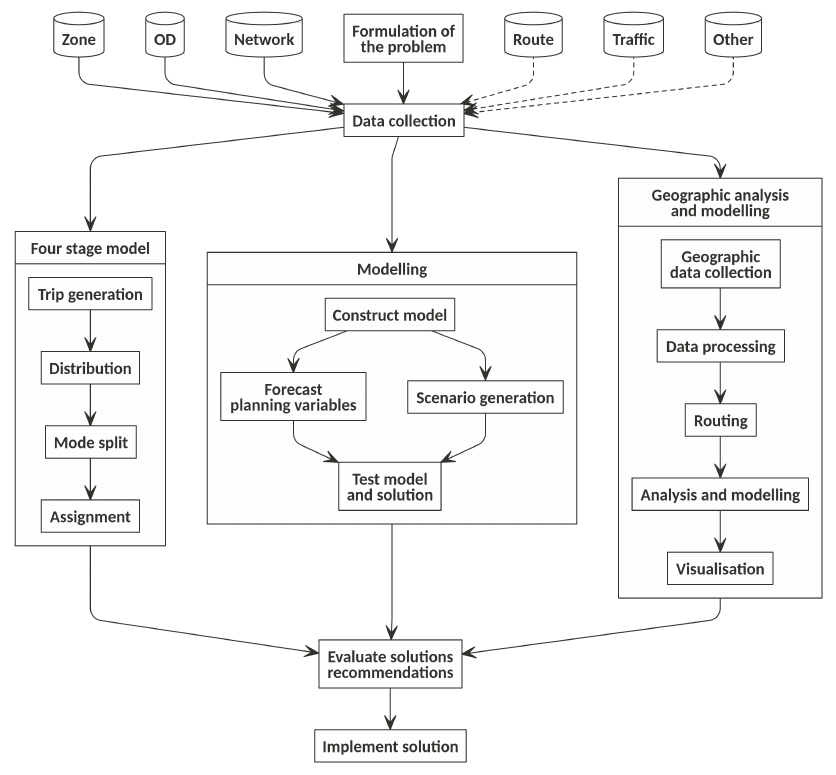
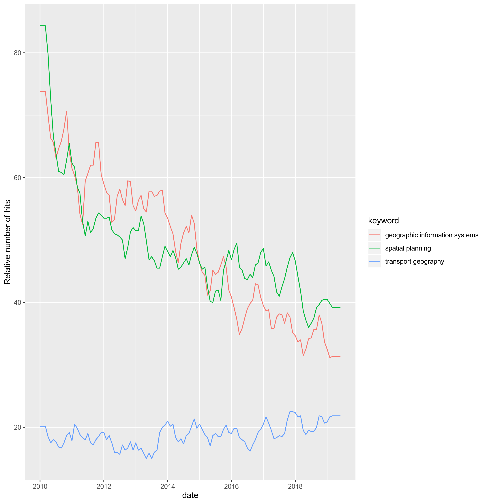
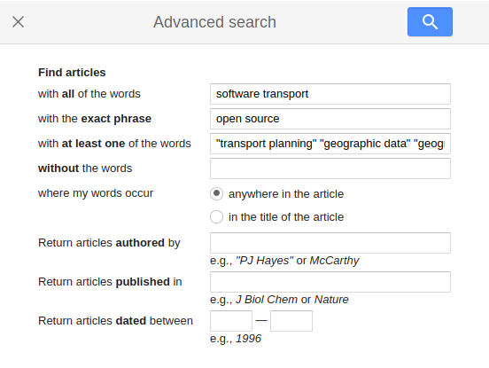
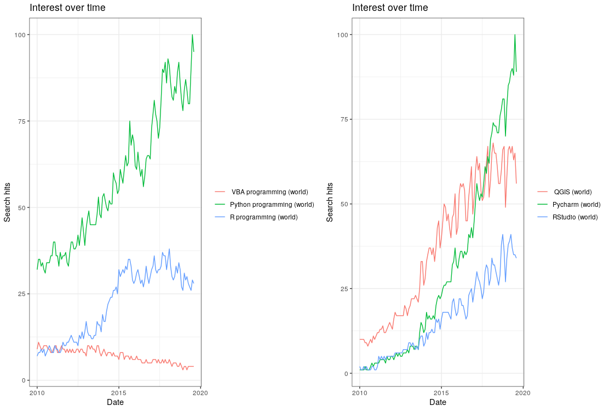

```{r, include=FALSE}
library(tidyverse)
```


```{r, echo=FALSE, include=FALSE, eval=FALSE}
# Priorty: write new tools of the trade section
# get citationschan_using_2019	
# refs_est = RefManageR::ReadZotero(group = "418217", .params = list(collection = "ABALWWZN", limit = 100))
# RefManageR::WriteBib(refs_est, "trafficEstimatr.bib")
# refs_sof = RefManageR::ReadZotero(group = "418217", .params = list(collection = "JFR868KJ", limit = 100))
# refs_gis = RefManageR::ReadZotero(group = "418217", .params = list(collection = "KUXG5CJL", limit = 100))
# refs_geo = RefManageR::ReadZotero(group = "418217", .params = list(collection = "9K6FRP6N", limit = 100))
# refs_mod = RefManageR::ReadZotero(group = "418217", .params = list(collection = "BN2XXKPI", limit = 100))
# refs_tds = RefManageR::ReadZotero(group = "418217", .params = list(collection = "R38L2EXB", limit = 100))
# o = ls()
# r = o[grepl(pattern = "refs_", x = o)]
# # refs = c(refs_sof, refs_gis, refs_geo, refs_tds)
# refs = do.call(what = c, args = mget(r))
# ref_df = as.data.frame(refs)
# # View(ref_df)
# RefManageR::WriteBib(refs, "references.bib")
citr::tidy_bib_file(rmd_file = "README.Rmd", messy_bibliography = "~/uaf/allrefs.bib", "refs-new2.bib") 
# n_words = wordcountaddin::text_stats("README.Rmd")
# word_count = readr::read_csv("word-count.csv")
# word_count_new = rbind(word_count, data.frame(date = Sys.Date(), n_words))
# readr::write_csv(word_count_new, "word-count.csv")
# ggplot(word_count_new) +
#   geom_line(aes(date, n_words)) +
#   xlim(as.Date(c("2019-01-01", "2020-01-01"))) +
#   ylim(0, 5000)
# f = "~/hd/books/David E. Boyce, Huw C.W.L. Williams/Forecasting Urban Travel (599)/Forecasting Urban Travel - David E. Boyce, Huw C.W.L. Williams.pdf"
# img_file <- pdftools::pdf_convert(f, format ='tiff', pages = 1:9, dpi = 400)
# txt = tesseract::ocr(img_file)
```

```{r, include=FALSE}
knitr::opts_chunk$set(echo = FALSE, warning = FALSE)
online = curl::has_internet()
```

<!-- should be integrated in transport planning tools. -->
<!-- --- software for transport data analysis, modelling and visualisation --- -->
<!-- workflows in academic, public sector and private consultancy transport planning contexts still tend to separate vital geographic processing and map making stages from the rest of the analysis. -->


# Abstract {-}

<!-- Tools for geographic analysis have long been used in transport planning. -->
<!-- , alongside other (typically primarily economic and engineering) considerations. -->

<!-- Transport is inherently geographic, involving the movement of people and goods between places along spatial networks. -->
<!-- Decarbonising transport systems is vital for the future. -->
<!-- Yet geographic analysis is often treated as an optional 'add-on'  transport data analysis and modelling. -->
<!-- This dichotomy, between 'geographic' and 'non-geographic' analysis in transport planning is undesirable because it: -->
<!-- (1) reduces researcher effectiveness due to the time-consuming process of 'context switching'; -->
<!-- (2) prevents reproducibility, requiring installation and management of geographic and non-geographic tools; and  -->
<!-- (3) hides vital geographic components in transport plans, with adverse consequences for interventions that can benefit from being placed where they are most needed. -->
<!-- --- from policies encouraging car sharing to investment in geographically specific sustainable transport infrastructure networks --- -->
<!-- in terms of the economic, social and environmental benefits of different scenarios. -->
<!-- The continued dominance of closed software in the field -->
<!-- --- at a time of innovation in computer hardware and software and uptake of open source software in fields such as data science --- -->
<!-- also has negative consequences in terms of reproducibility, transparency, scalability of solutions and public participation in the wider transport planning process. -->
<!-- or difficult to integrate into the wider planning process or both. -->
<!-- , with a focus on geographic data analysis, routing and route network analysis. -->
Geographic methods have long supported transport planners to develop effective and evidence-based interventions that are appropriate to local contexts.
Many popular 'tools of the trade' for geographic analysis used in practice are proprietary, reducing access to the benefits of methods such as spatial interaction
modeling, routing and route network analysis.
In this context, the aim of this paper is to explore emerging open source
tools for geographic analysis in transport planning, with reference to the literature.
A key finding is that a growing number of open source options exist.
These can be classified as command-line interface (CLI), graphical user interface (GUI) or web-based tools, instances of which can be accessed remotely or set-up locally.
Open source tools for transport planning come in many forms, ranging from single functions dedicated to a particular task to large software projects and enabling geographic analysis at every stage of the transport planning process, from data collection and demand modeling to visualization of results on publicly available and interactive web-based maps.
Although options are abundant, many lack documentation explaining how they can be used 'in production' and few case studies exist showing how they can support established transport planning workflows.
Thus, while open source tools for geographic analysis in transport planning *as they exist today* hold great promise, their *future potential* is even greater.
There are many ways for developers, researchers, practitioners and the interested public to participate and 'fill gaps' in the emerging landscape, particularly in relation to: integration and cross-compatibility of diverse tools; accessible tutorials; and real world case studies published in the academic literature.
The paper concludes that time invested in developing open source tools and associated communities of practice is time well-spent.
<!-- such as MATsim and SUMO (which have limited geographic analysis capabilities), in addition to more general programs such as QGIS, as well as open source languages such as R and Python which are used as the foundation of a growing number of 'packages' for transport planning. -->
<!-- Due to the size and rapidly evolving state of the software landscape for transport planning, the paper cannot be complete in its coverage. -->
<!-- However, the focus on a specific aspect of transport planning --- geographic analysis --- highlights themes, such as ease-of-use and community support, that may be relevant to other branches of the planning process. -->
<!-- In light of the rapid growth in the size, number and quality of open source tools for transport planning, there has never been a better time for transport planners to adopt open source solutions end-to-end in their everyday practice. -->
<!-- notwithstanding institutional barriers,  -->
<!-- Each ecosystem is found to provide numerous 'tools of the trade' for integrating geographic analysis in transport research, some of which are already being used in practice. -->
<!-- In addition to integrating geographic considerations, the shift to such open source solutions will have wider benefits for reproducibility, transparency and democratic accountability in transport planning. -->
<!--  transport planning experts and the public alike, -->
<!-- Ultimately, by highlighting cost effective and geographically targeted interventions, integrating geographic analysis in transport planning could lead to better decision making. -->
<!-- and support the global efforts to transition away from fossil fuels and towards a healthy, low carbon transport system. -->

<!-- ### Notes/questions -->

<!-- This paper is work in progress and its focus has shifted over time. -->
<!-- A previous working title was "Integrating geographic analysis in transport planning: new open source tools for the trade". -->
<!-- The need to integrate geographic analysis in transport planning is still a central theme of the paper but the focus is now on solutions, in the form of open source software. -->
<!-- Does the paper now have too much on the importance on integrating geographic analysis in transport planning, given the new emphasis? -->
<!-- And are there any other open source software projects I should include, within or in addition to the overview of the three ecosystems selected? -->


# Introduction: geographic analysis in transport planning {#intro}

<!-- : the importance of geographic analysis in transport planning -->
<!-- Should that heading omit the "Introduction:" part? -->

Transport planning is an applied discipline involving developing local policies and the design and placement of physical infrastructure including ways --- highways, railways, cycleways and footways --- for the greatest economic, social and environmental benefit [@oflaherty_transport_1997; @parkin_designing_2018].
Planning also involves thinking about the future, envisioning scenarios of change and making the
case for change [@timms_imagineering_2014].
Successful transport plans are therefore a combination of geographically specific recommendations (e.g. "build this way here") and long-term strategies guided by citywide, regional and national visions (e.g. "imagine the benefits of making the city free from private cars by 2030").
The rewards can be great: transport planners who have designed --- and helped to implement --- plans appropriate to the needs of an area leave a legacy that will benefit people and the environment for generations to come.^[
Articles about successful transport planners illustrate the point.
Ben Hamilton-Baillie (1955 - 2019), for example, was an influential transport planner and street designer whose obituary emphasised the "hundreds of thousands of people who are safer and happier as a result of his achievements" (Tim Stornor, quoted in [TransportExtra](https://www.transportxtra.com/publications/local-transport-today/news/60655/obituary-ben-hamilton-baillie/)).
]

Transport planning can be considered as "more of an art than a technique", although *good* transport plans also rely on robust analysis and modelling of sometimes large and usually spatial input datasets  [@ortuzars._modelling_2011].
Ways and other pieces of transport infrastructure must *go somewhere*;
transport planning involves consideration of where investment and other interventions are most needed.
Tools for geographic analysis have been used in transport planning since at least the 1990s, when local transport planning bodies in the United States started using geographic information systems (GIS) software to support their transport planning activities [@anderson_applying_1991], taking advantage of newly available software and hardware such as the Intel 80386 processor (first released in 1985) which could run early proprietary GISs such as 'SPANS' [@ebdon_spans_1992].

Despite the inherently geographic nature of movement, and the growth of GIS in transport planning, the importance of geographic in transport systems has long been overlooked [@rodrigue_geography_2013], notwithstanding efforts to formalise the field of 'GIS-T', described in the next section.
Geographic methods --- such as origin-destination modelling, route assessment and spatial network analysis --- are prominent in the literature, providing evidence for a range of transport planning interventions [e.g. @jappinen_modelling_2013;@larsen_build_2013;@tribby_highresolution_2012].
But there has been less research into digital geographic *tools*, as discussed in Section \@ref(the-current-landscape),  despite the fact that geographic methods must be accompanied by software and a user interface if they are to be of use in practice.

A range of data driven transport planning approaches has evolved in recent years to take advantage of new datasets and technologies.
Large movement datasets from disruptive 'ride hailing' firms have been used to better understand parking patterns [@aryandoust_cityscale_2019];
'deep learning' has been used to forecast demand for transport services in near real-time [@liao_largescale_2018].
Such novel geographic approaches can be defined as Geographic Data Science, a still emerging field that calls for the tighter integration between data science and geographic research [@singleton_geographic_2019].
While there is much academic activity in this direction, the extent to which new geographic tools have gained traction in practice, and in transport planning practice in particular, is debatable.
In this context, the goal of this paper is to add to the literature on geographic tools in transport planning, with a focus on open source options.

At this point some definitions are in order.
Although ubiquitous in the literature, terms such as 'tool', 'software' and 'model' are often used interchangeably, relying on the (potentially unsafe) implicit assumption that everyone shares the same idea of what they mean [see @salter_digital_2009 for an example].
For the purposes of this paper, a **tool** is a broad term referring to a modular piece of software or online service;
a **model**, by contrast, is method or process that is expounded in theoretical terms;
**software** is the collection of computer instructions that underlies digital tools, encoded in publicly available and transparent programming languages (in **open source software**) or in a 'binary' file that has "limits against usage, distribution, and modification that are imposed by its publisher" [@dhir_adoption_2017], the inner workings of which are obfuscated from the user (in **proprietary software**).
An increasingly used but seldom defined term in this context is **ecosystem** which, following @franco-bedoya_open_2017, we define as the wider community of people organizations that support the development of open source software.
The paper focuses on tools, as opposed to software or software ecosystems, because tools are tangible and widely understood (unlike software ecosystems) entities that the end user sees (as opposed to software, which is a rather esoteric concept).

<!-- Transport planning is embedded within broader democratic processes *and* local geographic contexts. -->
The focus on *open source* tools for geographic analysis in transport planning is timely because this is an area of rapid growth, as outlined in Section \@ref(open-source-tools).
The topic has yet to be explored in the academic literature, to the best of the author's knowledge.
A deeper reason that transport planning benefits from levels of transparency and citizen participation that are more easily reached with open source solutions than proprietary solutions [@peters_citizen_2020].
Transport planning involves decisions about how public funds, spaces and other shared resources are used.
It is, to a greater or lesser extent, part of wider democratic processes that reflect contemporary political and societal priorities [@legacy_there_2016].
These priorities have shifted substantially over the past few decades, meaning that transport plans based on out-of-date ideas or faulty model assumptions (such as the assumption that congestion can be tackled by building more roads) can lead to unwanted impacts (such as increased congestion), which can be fatal [@hollander_transport_2016].

The importance of transparency and democratic accountability in transport planning (and hence the importance of open source tools in transport planning) has increased alongside wider campaigns for evidence-based decision making and 'participatory democracy' [@monbiot_out_2017;@hackl_promoting_2019], and growing evidence that transport systems cause substantial damage to the environment and human health and wellbeing.
Roads are now the "leading cause of death for children and young adults aged 5-29 years" with 1.35 million people killed and tens of millions injured and disabled each year due a range of factors including unsafe speeds, weak road traffic laws, lack of enforcement and poor infrastructure that forces pedestrians and cyclists to mix with motorised modes [@world_health_organization_global_2018].
The air pollution impacts could be even greater, with a growing body of research linking air pollution to Alzheimer's disease, lung cancer and heart disease among hundreds of millions of sufferers worldwide [@kampa_human_2008; @kilian_emerging_2018].
Transport is responsible for a quarter of global greenhouse gas emissions and growing [@harrison_environmental_2017], and is one of the hardest sectors to decarbonise [@moriarty_prospects_2008], meaning that reducing transport energy use is an urgent priority.
<!-- affecting the global population, especially the projected 1.4 billion people who will live in low elevation (less than 10 m above sea level) coastal zones by 2060 [@neumann_future_2015]. -->
<!-- Transport planning has the potential to improve health outcomes. -->
<!-- Motor traffic can be reduced and redirected to minimize the amount of pollution that reaches vulnerable lungs. -->
<!-- Transport planning can have positive health impacts by enabling millions of people to integrate physical activity into their everyday lives, thereby tackling the 'obesity crisis' [@yang_travelobesity_2013]. -->
<!-- Another entrenched global challenge in the 21^st^ Century is social and economic inequality. -->
<!-- Transport planning can tackle inequality by prioritising modes that are accessible to a wide range of people, from '8 to 80 year-olds'.^[The term "from 8 to 80 year olds" is used informally by transport planning practitioners to convey their intention to design for everyone, as exemplified by the use of the phrase in a 2015 article in the [Guardian](https://www.theguardian.com/uk-news/davehillblog/2015/sep/23/whitechapel-high-street-cycle-superhighway-bus-stop-bypass-is-a-mess).] A recent policy driver of transport planning is climate change mitigation. -->

Transport planning is inherently embedded within local geographic contexts because transport systems, and associated networks of physical infrastructure, are highly localised [@barthelemy_spatial_2011; @levinson_network_2012] and to some degree dynamic [@xie_evolving_2011] phenomena.
Transport planning is therefore fundamentally a *geographic activity*.
All accurate geographic coordinates are defined with reference to the Earth's surface, either via geographic or projected coordinate systems [@sherman_desktop_2008].
By extension, transport planning is a geographic enterprise.

The influential  textbook *Modelling Transport* outlines the main stages of transport planning as follows [@ortuzars._modelling_2011].

1) problem formulation
2) data collection
3) modelling/analysis
4) evaluation
5) implementation of solutions

Each of these stages, illustrated in Figure \@ref(fig:schematic), has geographic components.
The 3^rd^ stage, can refer to at least three distinct processes: the 'four stage' transport model (left box); statistical modelling (central box) or geographic analysis and modelling (right box, Figure \@ref(fig:schematic)).
The wider point is that geographic techniques can supplement and in some cases replace traditional modelling, and the classic four stage transport model.
Many of the inputs (datasets with geographic coordinates) and outputs (maps and geographically specific recommendations) shown in Figure \@ref(fig:schematic) are spatial, suggesting the importance of geographic tools throughout the transport planning process.

```{r schematic, fig.show='hold', out.width="100%", fig.cap="Schematic diagram illustrating the modelling process, geographic analysis and the four-stage in the context of the wider transport planning process (adapted from Ortúzar and Willumsen, 2011, with the 'Geographic analysis and modelling component' added for this paper)."}
# knitr::include_graphics(c("4stage.png", "geo-4stage.png"))
# knitr::include_graphics("flow-diagram.pdf")

```

**Formulation of the problem** (stage 1 in the transport planning process illustrated in Figure \@ref(fig:schematic)) and identification of the scope of solutions that the transport planning process can propose is inherently geographic.
The first step of many projects is defining the 'region of interest'.
This step has important implications because it can focus the analysis on areas where solutions are most likely to be implemented and, conversely, highlight the potential for inter-regional collaboration.
Although the region of interest may be pre-determined by administrative boundaries over which a planning authority presides, geographic analysis this first stage in the transport planning process can help refine the definition of the 'region of interest' to include different 'spheres of influence' such as the wider catchment area, the administrative region, and the area that is the focus of the study. 
<!-- Defining, demarcating and visualising the study region in a more nuanced way could... -->
<!-- Todo: could add (e.g. the city centre) and other comments to each sphere comment. -->
<!-- To take one example, in a project where the study region was Leeds city centre... -->

**Data collection** (stage 2) is an explicitly geographical activity, although in some cases the geographic components of valuable data are not used (origin-destination datasets in which the coordinates of origins and destinations are excluded represent a common example).
Geographic analysis tools can support this stage not only by providing descriptive overviews of the datasets available to planners (and their limitations such as parts of a city lacking in data), but by flagging places where additional monitoring is needed [e.g @lindsey_minnesota_2013].

Likewise, **modelling** (stage 3) is a central component of data-driven transport planning.
Whether the modelling involves a four stage model, statistical modelling or geographic analysis, it inevitably contains some geographic analysis. 
<!-- (in the 21^st^ Century this stage could more usefully be called **modelling and data analysis**). -->
Geographic analysis is implicit in the classic four-stage model: 1) trip generation (the number of trips generated by each zone in a region) is influenced by geographic factors such as number of buildings in the direct surroundings; 2) the distribution of these trips to destinations depends on explicitly geographic factors such as absolute and relative distances; 3) mode split is influenced by geographic factors such as the gradient and motor traffic speeds and volumes associated with routes between origins and destinations; and 4) assignment to the route network clearly depends on a realistic representation of footways, cycleways, highways and other geographic entities such as traffic lights that affect route choice.
Likewise statistical modelling includes consideration of trip distances and destinations, which imply some level of geographic analysis.
Four-stage and statistical modelling options can be supplemented by **geographic analysis and modelling**, something that has been recognised since at least the 1990s [@anderson_applying_1991].
Critical to any modelling exercise are scenarios, which can be either 'global' (such as a nationwide increase in fueld tax) or 'local' (such as the creation of new public transport routes on specific roads) in nature.
The latter type of scenario require geographical inputs, such as simulating a new cycleway or bus stop.
These are arguably more tangible and relevant to the city and regional levels at which many transport plans are developed than abstract 'global' changes [e.g. @larsen_build_2013].

Geographic considerations are particularly important in stage 4, **evaluation of solutions and recommendations** to policy makers, but are often overlooked.
If recommendations resulting from an 'optimal' model have geographically uneven impacts, it risks exacerbating existing spatial inequalities.
Geographic analysis of the results of the transport planning process, in addition to geographic analyis of input data, can support more spatially equitable development which could have a co-benefit of reducing travel demand:
wage and other differences between cities are a major driver of (often energy intensive) inter-city travel demand.
And of course the the implementation of effective solutions relies on results that are specific, including being geographically specific and presented in clear and accurate geographic visualisations [@pensa_supporting_2013].
<!-- Todo: add refs -->

The stages represented in Figure \@ref(fig:schematic) have been criticized for being simplistic, linear and 'top-down', with particularly strong criticisms focusing on the lack of stages for impact assessment and public participation [@lofgren_considering_2018;@tornberg_making_2018], and more sophisticated representations of key stages in the planning system have been expounded for some time [@batty_planning_1995].
However, there is little doubt that the 'formulate → collect → model → evaluate → implement' approach continues to be popular and that, within this framework, each stage (particularly 'modelling' which includes geographic analysis and modelling) could benefit from increased access to geographic insights.
<!-- --- derived from geographic data and geographic analysis tools --- in support of 21^st^ Century policy drivers. -->
Due partly to data and computing limitations (outlined in the next section) geographic considerations are not always considered, with consequences for the solutions resulting from the transport planning process and the extent to which they adapt to local geographic factors.
Lack of access to, knowledge of and skills in the use of tools for geographic analysis represent another reason why geographic factors may be excluded from transport plans (although evidence of the tools that transport planners use and can use is scarce, suggesting areas of future research, as discussed in Section \@ref(conclusion)).
There *is* evidence that these 'barriers to entry' for geographic analysis --- at high resolution based on high quality data and high performance software --- are being removed, as outlined in Section \@ref(open-source-tools).
In this context, the aim of this paper is to explore emerging open source
tools for geographic analysis in transport planning, with reference to the literature.
<!-- , with a focus on geographic data analysis, routing and route network analysis.
todo: include this at the end -->

<!-- The paper is structured as follows... -->
The increased availability of open access geographic data and high performance computing technologies (in addition to policy drivers increasing demand for geographic analysis) over the last few decades is discussed in the next section.
Despite the increasing availability of open source options, proprietary tools still appear to dominate transport planning in practice, as we will see in Section \@ref(the-current-landscape).
The nature and functionality of open source tools for geographic analysis in transport planning is outlined in Section \@ref(open-source-tools).
Section \@ref(conclusion) concludes by summarising the state and future prospects of open tools in transport planning, highlighting gaps in the current crop of open source options, and flagging ways of getting involved to improve the provision of open source tools for the benefit of researchers, companies, governments and interested citizens with stakes in transport planning processes. 

<!-- Transport planning documents often contain maps only for the *proposed intervention*, omitting important geographic data (and analysis) showing the geographic factors that were considered during and influenced the final design. -->
<!-- To pick one prominent example... -->


<!-- Perhaps in response to an upsurge in the amount of geographic transport data available, interest in geographic analysis in transport planning journals seems to have grown over the last decade. -->


<!-- relative to other terms, according to data obtained using the **gtrendsR** package [@massicotte_gtrendsr_2019] from Google Trends (Figure 1). -->
<!-- It is interesting to compare this growth with relative levels of interest in 'geographic information systems' and 'spatial planning', both of which seem to have seen relative declines over time, notwithstanding the limitations associated with search data [@mellon_internet_2014].  -->

```{r, eval=FALSE}
library(gtrendsR)
# res_all <- gtrends(c("transport geography", "geographic information systems", "geocomputation"), time = "all")
res <- gtrends(c("transport geography", "geographic information systems", "spatial planning"), time = "2010-01-01 2019-08-01")
head(res$interest_over_time)
tail(res$interest_over_time)
head(res$interest_over_time$time)
class(res$interest_over_time$time)
unique(res$interest_over_time$keyword)
nrow(res$interest_over_time) / 3 / 12
nrow(res$interest_over_time) / 3
res$interest_over_time$date = rep(seq(from = as.Date("2010-01-01"), to = as.Date("2019-07-01"), length.out = 116), 3)
start_rows = 1
end_rows = nrow(res$interest_over_time) / 3

res$interest_over_time$hits_smoothed = c(
  zoo::rollmean(res$interest_over_time$hits[start_rows:end_rows], 6, fill = "extend"),
  zoo::rollmean(res$interest_over_time$hits[(start_rows:end_rows) + end_rows], 6, fill = "extend"),
  zoo::rollmean(res$interest_over_time$hits[(start_rows:end_rows) + 2 * end_rows], 6, fill = "extend")
)
ggplot(res$interest_over_time) +
  geom_line(aes(date, hits_smoothed, colour = keyword), size = 2) +
  ylab("Relative number of hits") +
  theme(legend.position = c(0.7, 0.8))
  
ggplot2::ggsave("google-trends.png", width = 6, height = 4)
```

```{r, fig.cap="Relative level of interest in search terms related to 'geographic information systems', 'geocomputation' and 'transport geography' inferred from google search data, obtained with the gtrendsR R package. Code to reproduce the plot is hosted in this paper's code repository.", out.width="70%"}
# 
```

<!-- The growing research interest in the subject is also reflected in teaching. -->
<!-- Modules dedicated to Transport Geography have been advertised at the Universities of Aberdeen and Hofstra and, at the University of Leeds the Masters module Sustainable Spatial Planning and Analysis ([SSPA](https://github.com/ITSLeeds/SSPA)) is focussed on GIS skills for transport planning (declaration of interest: I teach on this module), and there are even dedicated 3 year degrees Transport Geography. -->


<!-- , in relation to the history of geographic thinking in transport research and practice (in Section 3) and the resulting specialisation and monopolisation of particular transport planning software products (outlined in Section 4). -->
<!-- The focus of the paper is Section 4, which reviews open source software ecosystems that enable an integrated approach, which combines non geographically explicit stages (e.g. modelling) and geographic processing stages *in a single workflow*. -->
<!-- Three software ecosystems are reviewed in detail: -->
<!-- the statistical programming language R [@rcoreteam_language_2019], -->
<!-- the general purpose programming language Python [@rossum_python_1995], -->
<!-- and the desktop GIS QGIS [@qgisdevelopmentteam_qgis_2019]. -->
<!-- Alternative current and potential future approaches, including 'cloud lock in' are discussed; and the relative merits of different approaches are discussed. -->
<!-- Building on this discussion, Section 6 concludes by returning to the importance of integrating geographic analysis in transport planning workflows. -->
<!-- Before proceeding with the main task of this paper --- to review new tools for integrating geographic analysis in transport planning, and provide guidance to transport researchers and practitioners tackling 21^st^ Century challenges --- it is worth taking a step back, to think about the key policy drivers of 21^st^ century transport planning. -->

<!-- and outlines concrete steps that can be taken to accelerate the transition to open source software in transport planning in support of policies that accelerate the transition away from fossil fuels. -->

# Policy and technological drivers 
<!-- for geographic analysis in transport planning -->

Two major drivers of change in transport planning tools have historically been technological development and shifting political priorities [@boyce_forecasting_2015] and each of these have emphasised the importance of geographic analysis in recent years.
Environmental, health and equality regulations --- which can be seen as a manifestation of political change --- have also influenced transport planning practice and some specific transport planning tools have emerged to tackle particular issues [e.g. @vandenbulcke_mapping_2009].
Environmental concerns, including fears about the impact of climate change, have risen up policy agendas in recent years, meaning that such environmental policy drivers a likely to become more important in the coming years.
In parallel, the 'obesity crisis' and mounting evidence of the health benefits of physical activity have provided impetus to plans that prioritise walking and cycling, with environmental co-benefits.
There have also been calls for more 'bottom-up' and participatory (implying open source) approaches, although transport planning practice has been slow to change in this direction [@legacy_there_2016].
No less important is the demand for localised results; while a national transport model can provide a high level overview of the transport system for policy-makers, tools that provide geographically specific results, potentially down to the street level, can support transport planners 'on the ground'.
These two factors drive demand for transport planning tools that are both open and enable geographic analysis.
A final driver of demand for such tools is technology.
Rapidly emerging digital technologies could transform transport planning, with two-way communications between planning authorities and citizens, and even peer-to-peer communications on transport planning issues, now feasible.^[
See https://www.cyclescape.org/ for an example of such a peer-to-peer transport planning tool.
]
These drivers of change provide the context in which open source tools for transport planning are being developed.

## Political drivers

The history of transport modelling shows that transport planning software was originally designed to plan for "increased use of cars [for personal travel], and trucks for deliveries and goods movement" [@boyce_forecasting_2015].
Despite the fact that policy drivers have changed dramatically --- with climate change mitigation, air quality improvement and public health prioritised in the 'sustainable mobility paradigm' [@hickman_transitions_2011] --- incumbent transport software still largely based on tools focussed on motor traffic, emphasising travel time savings and (de)congestion effects of interventions at relatively low levels of geographic resolution that may be insufficient to map the relatively intricate details needed to effectively design for active transport [@parkin_designing_2018].

<!-- Todo: define 'tool' vs software vs ecosystem -->

Tools for 21^st^ Century transport planning need to tackle very different questions, such as:
What are the barriers preventing people from switching to more sustainable modes of transport, and where are these barriers located?
How are transport behaviours likely to shift in the future, in response to technological changes including autonomous vehicles and the continued rise of online working?
Where will different types of intervention be most effective?
And how can citizens be engaged in transport decisions?
Tools that can help answer these questions are becoming an increasingly important part of the transport planner's cabinet [@te_brommelstroet_developing_2008].

As the gap between what the science seems to say is necessary in the near future and the reality of polluting and unhealthy transport systems grows, so does the need for transparent models that stand up to scrutiny and enable participation and informed debate.
This has been well documented in with respect to energy models by @morrison_energy_2018, who observed that "opaque policy models simply engender distrust".
The same could be said of transport models, driving demand for tools that are open to public scrutiny and community involvement.
In parallel, growing awareness of the need for sustainable transport planning solutions has also driven demand for geographically locallised transport planning tools.

## Demand for localised results

With the emphasis shifting to reducing travel by building 'liveable' communities and enabling mode shift [@sallis_use_2016], localised and geographically specific considerations may become increasingly prominent in future plans.
To illustrate this point, imagine being the mayor of a major city that has declared a 'climate emergency' and who has been given the task of leading the transition away from fossil fuels [@hadfield_financing_2019].
Policies such as carbon taxes would undoubtedly be needed at the national level but your focus would naturally be on the bounds of the local authority over which you have some power.
<!-- have geographic implications, but the intervention itself (charging a fixed price for the extraction and sale of atmosphere polluting substances) could be essentially non-geographic. -->
Except for specific national transport policies such as fuel tax, transport policies tend to have geographic outcomes (to build new cycle infrastructure, for example, which must go somewhere) and this is especially so for low-carbon transport plans which tend to operate over distances of hundreds of metres rather than dozens of kilometres, due to inherent limits in the speeds of active modes [@iacono_measuring_2010].

Even high level national plans for a walking and cycling revolution must be implemented locally, down to the level of streets, as illustrated by the still ongoing local implementation of Dutch cycling ambitions [@pucher_making_2008]. 
The political-democratic and local-geographic aspects of transport planning can be considered in isolation, but an integrated approach is necessary for effective policies [@hull_policy_2008].
This is well illustrated by prominent Mayoral transport policies in cities such as 
London,[^1]
Paris^[
The current Mayor of Paris, Anne Hidalgo, sees transport as a priority and has plans to make public transport free. See 
[paris.fr](https://www.paris.fr/rechercher/transport).
],
and Bogotá,^[
Bogotá has an innovative and prominent transport policy, led by the two times mayor Enrique Peñalosa, who has led the roll-out of major bus and cycleway projects in the city. See [sitp.gov.co](https://www.sitp.gov.co/).
]
where geographically specific interventions (such as congestion charges in carefully demarcated central zones) combined with citywide vision have enabled modal shift.

[^1]: Transport is a major electoral issue in London and the current Mayor, Sadiq Kahn, has made tackling air pollution a policy priority. See [tfl.gov.uk/corporate/about-tfl/the-mayors-transport-strategy](https://tfl.gov.uk/corporate/about-tfl/the-mayors-transport-strategy).


With issues such as climate change, air pollution, obesity and social inequalities high on the political agenda, and the benefits for 'early adopters' of evidence-based interventions to accelerate the shift away from the motor car in cities such as London, Paris and Bogotá, pressure is growing on local, city and national transport planning departments to act.
But what should they do, and where should they intervene?
Geographical data and to some extent analysis (e.g. calculating distances) was integral to this 'computational transport planning' activity, but input datasets were limited in size and accuracy.
Partly in response to such drivers for geographic analysis in transport planning, there have been various attempts to define a more applied GIS approach transport research.
@miller_potential_1999 advocated a new field, GIS for Transport (GIS-T), posited as an academic field at the interface between transport planning and GIS.
Although the label gained limited traction in academia or practice, Harvey Miller's call for a shift to methods and tools has been answered in the 2000s and 2010s by researchers who have developed ideas and software that transport planners can actually use, including the Australian Research Infrastructure Network (AURIN), which is widely used for transport planning and public health research in Australia [@pettit_australian_2014] and the Propensity to Cycle Tool (PCT, publicly available, including source code, at [www.pct.bike](https://www.pct.bike)) [@goodman_scenarios_2019].
<!-- refs? -->

## Technological drivers

Technological change has increased the capabilities of transport planners since the the beginning of the discipline, with transport planning tasks being an early use case of mainframe computers [@boyce_forecasting_2015].
With unprecedented access to increasingly detailed datasets on transport behaviours and infrastructure, transport planners today require tools that enable them to make sense of this 'data revolution' [@transport_systems_catapult_transport_2015].
The sheer volume and complexity of new datasets require new approaches that can scale and integrate multiple data sources [@lovelace_big_2016].
Advances in software and hardware allow not only for current transport systems to be modelled at high temporal and geographic resolution, but for future scenarios and 'model experiments' to be developed, which can support identification and implementation of the most effective interventions [@klosterman_what_1999].

With the explosion in open source software, which has risen to prominence data science, policy, data and technological drivers are pushing for geographic analysis to be better integrated in transport planning tools, alongside wider shifts for towards more data driven, transparent and democratically accountable transport planning workflows.
At present this dream is far from reality, despite the long history of geographic methods, public involvement and technological innovation in transport planning.


<!-- This *policy* question raises important *research* questions: -->
<!-- Which methods are most suitable for designing future transport systems? -->
<!-- What is the evidence base, and analysis, that should be used to inform transition towards a healthy, zero carbon transport system? -->
<!-- Which interventions, from the multitude of options available, are most likely to be effective? -->
<!-- And where are different types of intervention most likely to succeed? -->
<!-- The premise of this paper is that new approaches, enabled by software, are needed to provide answers to these questions. -->
<!-- 21^st^ Century demands for transport planning cannot be delivered by 20^th^ century technology. -->
<!-- Could open source solutions are poised to bridge the gap between the geographic and the --- historically dominant --- non-geographic aspects of transport planning? -->
<!-- Planning for sustainable modes, walking and cycling in particular, requires analysis at higher geographic resolutions than planning for motor traffic. -->
<!-- Furthermore, the policy context increasingly demands transparency and citizen involvement in the decision-making process. -->
<!-- Only open source ecosystems, of the type outlined in Section \@ref(new-tools-of-the-trade) can deliver true transparency and encourage 'citizen science' for everyone. -->
<!-- These policy drivers make an exploration of open source options for transport planning workflows timely. -->

<!-- Additional drivers of change in transport planning software include new datasets and technologies. -->
<!-- Technological change has historically driven innovation in transport planning tools [@boyce_forecasting_2015] and the rate of change now is faster than ever. -->

<!-- In the inter-war period (1918-1939) disciplinary homes for transport research had yet to emerge and geographic analysis was limited by lack of datasets and computers on which to process them. -->
<!-- The term 'transport geography' itself only became widespread in the 1950s: -->
<!-- as noted in a report commissioned by the US Office of Naval Research: -->
<!-- "geographers, both in Europe and America, are coming to recognize that the study of the connections between areas and of spatial interchange can provide a new and deeper insight into the meaning of areal differentiation" [@ullman_transportation_1954].  -->
<!-- In the pre-computing age the relationship between geographic analysis and transport planning was characterised by growing interest in the topic, an understanding of the importance of geographic considerations in the design and evolution of transport systems, but lack of data and computational resources.^[ -->
<!-- @paterson_horse_1926, for example, speculated quite accurately on the continued rise of motor traffic at the expense of horse powered transport during the 20^th^ Century, noting the importance of geographic factors in determining mode choice, down to the street level: -->
<!-- "Many streets, like our Bond Street, Watling Street or Lombard Street, and in Seville, the Calle de las Sierpes or Kalver Straat in Amsterdam, may be unsuited to motor traffic, and frontage values may be so high that widening can hardly be considered." -->
<!-- In a geographic review of Japanese cities @trewartha_japanese_1934 also alluded to the relationship between geography and mode choice: -->
<!-- "widening and paving of [roads] have (sic) been accomplished [allowing] numerous taxis, motor busses, and tram cars contrasting with the slow human and animal-drawn carts and the ubiquitous bicycle". -->
<!-- Rapid industrialisation during the largely unconscious build-up to World War II was associated with major road building schemes in many developed regions, demanding the practical application of new methods from a range of disciplines [e.g. @greenshields_studying_1936]. -->
<!-- In the USA, highway engineering even became a recommended case study for geography lessons [@fox_main_1923]. -->
<!-- ] -->
<!-- At the turn of the computing age in the 1950s and 1960s transport planners, whose primary task was often to enable rapid growth in car ownership and use, quickly saw the potential for computational tools to assist their work [@boyce_forecasting_2015]: "essential to [new methods in transport planning] were new computational capabilities, the first mainframe computers, unprecedented in memory and speed [yet] tiny from today’s perspective". -->
<!-- As *Forecasting Urban Travel* [@boyce_forecasting_2015] recounts, geographic questions were at the forefront of many planners' minds and a key task for the early transport models was to visualise and model the results of large origin-destination surveys to help decide where new highways should be constructed. -->

<!-- Much of the early work in this field was publicly funded and focussed on solving real world problems associated with population growth, economic development, changes in lifestyles, and mobility behaviours. -->
<!-- However academics, and quantitative geographers in particular, soon started working with newly available transport datasets. -->
<!-- An important development was the emergence of spatial interaction models, which were formally defined, refined and implemented throughout the 1960s and 1970s [@wilson_statistical_1967; @wilson_family_1971]. -->
<!-- It is notable that Alan Wilson, whose research influenced both transport planning and academic practice, worked in both the public sector (for the UK's Ministry of Transport) and academia (the University of Leeds) while writing each paper. -->
<!-- Most academic research at the interface between transport planning and geographic research is far less 'practitioner facing' and, if anything, it seems that tools used in geographic analysis of transport systems in practice since the 1970s have diverged from academic research. -->

<!-- perhaps explaining why the field of Transport Geography, which emerged in the 1960s and grew rapidly since then [@hay_transport_1979], has (to the author's knowledge) had relatively few other notable impacts on transport planning practice. -->

<!-- By the late 1970s, there was enough research for review papers reflecting on the status of Transport Geography as a self-standing branch of Geography [@rimmer_redirections_1978]. -->
<!-- A book on the transport geography of India provides an insight into the field at the time, with a focus on infrastructure and statistics, transport geography sat firmly in the quantitative tradition of geographic research [@raza_transport_1986], despite Rimmer (1979) criticism that much of the field ignored the wider impacts of transport systems. -->
<!-- Geographic analysis in transport research was given a substantial boost in the 1990s, with the first publication of the Journal of Transport Geography [@knowles_research_1993]. -->
<!-- Transport Geography has subsequently come to be defined as a branch of geography. -->
<!-- Notwithstanding influential methodological and review papers proving transport planners with insight into the state-of-the-art [e.g. @martinez_new_2013], the level of engagement between academic transport geographers and transport planning practitioners is debatable (although the same could also be said of academic planners).  -->


<!-- Search term for interwar period: https://scholar.google.co.uk/scholar?q="transport+geography" -->


<!-- something on the lack of open source? -->

<!-- https://www.abdn.ac.uk/registry/courses/undergraduate/2016-2017/geography/gg4016
https://people.hofstra.edu/jean-paul_rodrigue/course_transport.html
 in Geography with Transport Studies BA advertised by the University of Leeds
-->


<!-- Transport planning has been slow to adapt to the data revolution and, while it evolves to enable a wider range of input data sources and analysis 'in the cloud', the open source element is conspicuously lacking. -->
<!-- To understand and effectively challenge the incumbent software landscape (which is described in Section xx) it is worth understanding something of the history that led to this situation. -->

<!-- # Geographic analysis and transport planning -->

<!-- The concept of integrating geographic data analysis in transport planning is not new, although tools and datasets for doing so quantitatively are. -->
<!-- Geographic perspectives have contributed to transport thinking for over 100 years, as documented in papers on geographic considerations in railway design and other transport engineering challenges [@farnham_relation_1912; @buxton_balkan_1908]. -->
<!-- Since then, the importance of geographic analysis in transport planning has only grown, with the realisation that interventions in the transport system are most effective when they are placed where they are most needed: infrastructure designs and localised policies are most effective when they account for the geographic distribution of intricate spatial networks and interacting places of transport supply and demand -->
<!--  [@rodrigue_geography_2013; @loidl_gis_2016; @lovelace_propensity_2017]. -->

<!-- The paper concludes that 'integrated approach' can support efficient, scalable and reproducible transport planning workflows which can provide a strong and transparent evidence base needed for rapid transition away from fossil fuels in the transport sector. -->

# The current landscape

In broad terms, digital transport planning tools are like any other computer program in that they take inputs which are processed to generate outputs [@knuth_art_1997].
The broader term 'transport model' is sometimes used interchangeably with transport software but in this paper we follow [@hollander_transport_2016] in using 'model' to refer to the theories and mathematics underlying transport planning software, rather than the software that implements the model.^[
There is of course a close relationship between transport planning software and models because theoretical models can inform the direction of software developments, as was the case with the development of spatial interaction models [@boyce_forecasting_2015].
Conversely, 'upstream' developments in computer languages affect the range of models that can be implemented, as can be seen with the current shift towards cloud-based and more visual and interactive transport models such as the open source [Streetmix](https://streetmix.net) and the Institute of Transport Engineers endorsed [StreetPlan](https://streetplan.net) tools for visualising 1D street layouts and cloud-based transport planning services such as [Remix](https://www.remix.com/).
]
In relation to the narrower concept of 'algorithm', transport planning software can be seen as a computing environment or system that provides a user interface to run a range of algorithms interactively on a range of input datasets to generate outputs that can feed into the wider transport planning process [@boyce_forecasting_2015].

Software for transport planning can be grouped by the scale at which it operates, with broad categories being microscopic and macroscopic (macro) models [@kotusevski_review_2009;@hildebrand_comparative_2014].
Microscopic transport models represent individual vehicles on the road network and are therefore able to represent localised phenomena such as traffic congestion.
Macro models, by contrast, represent aggregates of vehicular traffic over large spatial scales, in which "the total flow is studied" and behaviour of individual vehicles is omitted [@hildebrand_comparative_2014]. 
Of course the distinction is, in reality, an oversimplification: there is a continuum between macro and microscopic transport models; advances in computing increasingly enable both approaches to be combined, enabling researchers to choose the most appropriate spatial scales for their application [@moeckel_trends_2018].
The focus of this paper is on macro models which enable modelling of the implications of future changes in transport behaviour and infrastructure on flow at city scales, with results down the route network level (microscopic models tend to be used to model individual route segments and intersections), and their geographic analysis capabilities.

<!-- The geographic and non-geographic division of labour is a result of the history of transport planning software. -->
This history is detailed in Chapter 10 of *Forecasting Urban Travel* [@boyce_forecasting_2015] called "Computing environment and travel forecasting software", which provides an insight into how software has been used in transport planning over the years.
Of course, software development has always depended on the physical hardware on which it runs and the early days of transport planning software were characterised by bespoke programs running on mainframe computers and maintained by domain experts.
Transport planning bodies and researchers in the USA led developments in the 1960s and 1970s when computers first started to be used for transport planning, when the main problem that they addressed was how to deal with the explosive growth in car ownership and use that was taking place during those decades.
More overtly political factors also influenced the direction of transport planning software: 
"certain private firms complained to US DoT [Department of Transport] that its agencies were developing software in competition with the private sector", leading to the abandonment of publicly funded transport planning software development projects, notably UTPS [@boyce_forecasting_2015].^[
UTPS stands for the UMT (Urban Mass Transportation Administration, an agency of the DoT responsible for transport planning) Transportation Planning System (UTPS).
]
This transfer of transport planning software development to the private sector contrasts with the history of GIS.
The example of GRASS (Geographic Resources Analysis Support System) illustrates this point and helps explain the dominance of proprietary software in transport planning.
Like UTPS, GRASS was a publicly funded software project.
Unlike UTPS, it was made freely available to the public and was open sourced (in 1999), meaning that it has been under continuous development by state, academic and commercial organisation since 1982 [@neteler_open_2008].
Would the landscape of transport planning software have been different if the DoT had continued to fund software development projects?
That question is outside the scope of this paper.
What is certain, however, is that software used in transport planning over the past three decades has been dominated by companies and that the sector has been slow to adopt open an open source approach.

In response to the 'siloed' development of GIS and transport software, there have been calls for greater integration.
@loidl_gis_2016, building on the observation that "geography and GIS remained a niche topic within traditional transport modeling", made a case for strengthening the 'spatial perspective' in transport modelling.
The paper emphasised the growing importance of well-defined data types, disaggregating detailed (and difficult to interpret) transport model outputs, and geographic data visualisation and concluded that much further research is needed:
"future research and development is needed to combine geospatial functionalities with transport modeling,
while providing an efficient, interactive, visual interface for data exploration, manipulation, analysis
and visualization" [@loidl_gis_2016].
Although the paper focussed on conceptual issues rather than software per-se, it did identify mention four open source programming languages that could provide the foundation for future developments, two of which (R and Python) are covered in the next section.

Data preprocessing and analysis stages are generally done in dedicated transport planning and spreadsheet software.
Geographic analysis and cartographic visualisation stages are often done in a dedicated GIS.
Some prominent transport planning software products, and levels of support for geographic data analysis, are summarised in Table 1, which shows that popular transport planning tools have differing levels of geographic capabilities.

```{r, echo=FALSE, message=FALSE, warning=FALSE, eval=TRUE}
# geo_capabilities = "I, B, E, P"
# tms = readr::read_csv("https://github.com/ITSLeeds/TDS/raw/master/transport-software.csv")
# # tms$`Source of citations`
# tms$`Source of citations`
# 
# tms$I = c("Y", "Y", "Y", "Y", "Y", "Y", "Y")
# tms$G = c("Y", "?", "Y", "?", "Y", "?", "Y")
# tms$R = c("Y", "Y", "Y", "?", "Y", "?", "Y")
# tms$RNA = c("Y", "Y", "Y", "Y", "Y", "Y", "Y")
# tms$SV = c("Y", "Y", "Y", "Y", "Y", "Y", "?")
# tms$IV = c("?", "?", "?", "?", "?", "?", "?")
# tms$EX = c("?", "?", "?", "?", "Y", "?", "?")
# 
# tms_new = DataEditR::data_edit(tms)
# readr::write_csv(tms_new, "transport-modelling-software.csv")
tms = readr::read_csv("transport-modelling-software.csv")

tms = arrange(tms, desc(Citations))[1:5]

knitr::kable(tms, caption = "Sample of transport modelling software in use by practitioners, with citation counts based on citation from searches for the product name (plus company name for the common word 'cube') and 'transport planning'. Data source: Google Scholar searches, August 2020.", booktabs = TRUE)
# knitr::kable(tms, booktabs = TRUE, caption = "Sample of transport modelling software in use by practitioners. Note: citation counts based on searches for company/developer name, the product name and 'transport'. Data source: Google Scholar searches, October 2018.", format = "latex")
# tms$`Geographic capabilities` = c(
#   "Plotting, editing, import, buffer, intersections", # https://www.ptvgroup.com/fileadmin/user_upload/Products/PTV_Visum/Documents/Release-Highlights/PTV_Visum_18_release_highlights_EN.pdf # http://www.traffic-inside.com/2014/11/27/ptv-visum-tip-catchment-areas-accessibility-of-places-in-the-network/
#   "I, E, P, R"
# )
```

<!-- The geographic capabilities were assessed based on reading of publicly available manuals (to be linked to in an appendix accompanying this paper) and that each software product is actively developed, meaning that the results may change with additional information and subsequent releases. -->
An interesting observation is that the open source options --- MATSim, SUMO and sDNA --- all have limited 'in house' geographic capabilities.
This can be explained by the 'Unix philosophy', the second tenet of which is modularity, meaning that "each program should do one thing well", reducing duplication of effort and allowing the best tool to be used for each job [@gancarz_linux_2003].
The next section describes the this modularity in more detail, including outstanding support for geographic data in open source software.

There are many 'barriers to access' prominent tools in the current landscape of transport planning.
Proprietary tools are expensive (costing up to hundreds of dollars for a single license), ensuring that only a small fraction of transport planners, let alone the public, has access to them.
Many proprietary tools are tied to a particular Windows, preventing use in on other operating systems such as Linux, Mac and FreeBSD.
This reduces reproducibility of results and prevents 'citizen science' and educational projects that use the same tools as professional planners.
<!-- A final issue affecting reproducibility with the proprietary options listed in Table 1 is that they all have a prominent Graphical User Interface (GUI) (although they increasingly offer a command line interface, enabling scripting). -->
<!-- As is the case with GUI based GIS software, this has the "unintended consequence of discouraging reproducibility" by enabling the user to get to a solution without writing a script that others can use [@lovelace_geocomputation_2019]. -->

<!-- Another barrier, which may affect the open source options listed in Table 1 more than the proprietary options, is that they can be (in the author's experience) difficult to install and use. -->
<!-- This creates an additional barrier to the integration of geographic analysis in transport planning for people, especially the majority of people who have limited computing skills. -->
A wider barrier is that organisations' GIS and Transport functions tend to be siloed into their respective departments/teams with little communication between them, meaning that transport planners may not have access to the latest geographic data or software.^[
Thanks to Crispin Cooper, author of sDNA, for raising this barrier.
]
This relates to tools because if transport planners and GIS analysts are using different programs for their work, transport planners will be less likely to collaborate with people with geographic analysis skills or identify potential geographic solutions to their domain-specific problems.
The extent to which these barriers can be overcome by open source software ecosystems is explored in the next section.


```{r, echo=FALSE, eval=FALSE}
# alternative way to get citation data (WIP)
library(fulltext)
ft_search("visum", from = "crossref", scopusopts = )
scopus_search(query = "visum", key = Sys.getenv("SCOPUS"))
```

<!-- @kammeier_new_1999 -->

# Open source tools for geographic analysis in transport planning {#open-source-tools}

<!-- The previous sections support and expand on the two main premises of this paper: that geographic analysis has much to offer transport planning, and that the incumbent proprietary software products are not well suited to tackle 21^st^ Century transport planning needs. -->
<!-- In this section the paper shifts gear, and moves onto solutions. -->
The previous sections suggest that technological, environment and societal changes are driving demand for geographic analysis via accessible tools in transport planning.
This section reviews prominent open source tools that could, and in some cases already are, being used to tackle research, and increasingly applied, transport planning challenges.
Open source tools for geographic analysis in transport planning have not emerged in a vacuum.
They were developed in the wider landscape of open source software [@dhir_adoption_2017].

These tools could be classified by the five main stages illustrated in Figure \@ref(fig:schematic) (data collection, processing, routing, modelling and visualisation).
Instead, because many tools can be used in multiple stages, can be more usefully classified from the user's perspective.
Based on open tools identified through web searches, they can be classified into the follow broad, and to some extent overlapping,^[
Some tools can be used through multiple interfaces but most have a dominant interface type.
]
user interface (UI) types (see Table \@ref(tab:open-tools)):

- command-line interface (CLI) tools, primarily controlled by typing commands 
- graphical user interface (GUI) tools, primarily controlled by mouse clicks
- web user interface (WUI) tools that users access through a web browser
- web application programming interfaces (API) that computers access over the web

In this paper we will focus on projects in the first three categories.
Numerous open source 'routing engine' projects provide a range of high performance routing and other transport data analysis services via a web application programming interface (API).
While technically these can be used for geographic analysis tasks, they are more commonly used by transport planners as remote services, and are usually the preserve of software developers, so were excluded from Table \@ref(tab:open-tools).

## Defining open source

Before describing open source tools for transport planning, classified by their main user interface, is worth considering what 'open source' means.
<!-- and how the people, organisations and communities developing these technologies work; this to provide pointers for readers interested in contributing to open source transport planning software projects (more on this in the final section). -->

<!-- Despite the central role that open source software plays, powering the majority of the world's servers... -->
Open source software differs from proprietary software in that users are free to see, download and modify the source code.
Freedom is central to open source software, which is sometimes referred to simply as 'free software', defined by the Free Software Foundation (FSF) as follows:^[
See https://www.fsf.org/about/what-is-free-software for a full definition and context.
]

> software that gives you the user the freedom to share, study and modify it.

This adaptability is conducive to collaboration, the creation of mutually supportive user/developer communities and rapid evolution, making open source software ecosystems fast moving and highly diverse.
It is impossible to discuss all software options that could be used for geographic transport planning: there are literally thousands of software projects written in dozens of programming languages, many of which are no longer actively maintained [@coelho_this_2020].
Transport planners should use solutions that are future proof and actively maintained.

## Methods to identify open source tools

To identify open source tools for transport planning, a search approach was used to incorporate projects that have been written-up in the academic literature, and projects which exist only as software projects, with a minimum level of popularity.
The method was as follows:

1. Undertake searches of Google Scholar, DuckDuckGo and the popular code hosting platform with search terms set to identify open source projects.
2. Combine results from the searches into a single dataset and rank the projects according to evidence of usage.
3. Verify that the projects are open source and actively maintained by analysis of package documentation and source code.
4. Classify and the projects based on their main user interface, resulting in Table \@ref(tab:open-tools) (see the appendix for a complete table of results).
These tools are described in more detail in the following three sections.

The following search terms were used to find relevant projects using Google Scholar, the result of a search shown in Figure \@ref(fig:scholar-search):

<!-- > "open source" software "transport planning" "geographic data" OR "geographic analysis" OR "spatial data" OR spatial OR analysis" -->

> software transport "open source" "transport planning" OR "geographic data" OR "geographic analysis" OR "spatial data" OR "spatial network" 

```{r scholar-search, fig.cap="Illustration of the Google Scholar search terms used to identify open source software for geographic analysis in transport planning.", out.width="60%"}

```

To identify open source projects on GitHub's [advanced search page](https://github.com/search/advanced) a 'snowball' method, analogous to that used by @grabowicz_social_2012 in the context of social media, was used.
The 'topic' descriptions of previously identified open tools were used to identify additional projects and search terms.
This method worked as follows:

- The GitHub page of the previously identified project stplanr project was visited.
- One of the 'topics' in the stplanr repository was was the broader term `transport`, which was used to identify the SUMO project
- The SUMO project had the topic 'simulation', leading to the discovery of the A/B Street project

The complete list of GitHub topics used to identify projects was as follows (manual reading of the README for each project was used to confirm if the projects were related to transport planning, many were not, e.g. because they were for web transport rather than transport planning):

> [transport planning](https://github.com/topics/transport-planning),
[transport](https://github.com/topics/transport),
[transportation-planning ](https://github.com/topics/transportation-planning),
[traffic-simulation](https://github.com/topics/traffic-simulation), 
[simulation](https://github.com/topics/simulation),
[trajectory](https://github.com/topics/trajectory)

```{r open-tools, echo=FALSE, message=FALSE}
library(kableExtra)
# Include these?
# https://github.com/UDST/pandana
# https://github.com/dymium-org/dymiumCore
# https://github.com/bistro-its-berkeley/BISTRO
# https://github.com/LBNL-UCB-STI/beam
open_tools = readr::read_csv("open_tools.csv")
# table(open_tools$emphasis)
# edit the data:
# remotes::install_github("DillonHammill/DataEditR")
# open_tools_new = DataEditR::data_edit(open_tools)
# readr::write_csv(open_tools_new, "open_tools.csv")
names(open_tools) = tools::toTitleCase(names(open_tools))  
open_tools_filtered = open_tools %>% 
  filter(Emphasis != "interface") %>% 
  filter(Emphasis != "routing engine") %>% 
  filter(Type != "Routing engine")
open_tools_filtered %>% 
  mutate(Tool = paste0("\\href{http://", Website, "}{", Tool, "}")) %>%
  # mutate(Tool = paste0("[", Tool, "](", Website, ")")) %>%
  select(Tool, Type, Licence, Language, Stars, Citations, Reference) %>% 
  kable(format = "latex", escape = F, booktabs = T, caption = "Open source tools for geographic analysis in transport planning, based on data from Google Scholar, GitHub and web searches and classified in by their primary user interface. CLI, GUI and WUI refer to command-line, graphical user and web user interfaces respectively.") %>%
  pack_rows(group_label = "CLI", start_row = 1, end_row = 12) %>%
  pack_rows(group_label = "GUI", start_row = 13, end_row = 18) %>%
  pack_rows(group_label = "WUI", start_row = 19, end_row = 24) %>%
  kable_styling(bootstrap_options = c("hover", "condensed"), latex_options = c("scale_down"))
  # knitr::kable(caption = "Open source tools for geographic analysis in transport planning, based on data from Google Scholar, GitHub and web searches and classified in by their primary user interface. CLI, GUI and WUI refer to command-line, graphical user and web user interfaces respectively.")
```

To overcome the limitation that not all open source software projects are hosted on GitHub *or* described in academic papers, snowballing via fora such as the [QGIS plugin homepage](https://plugins.qgis.org/), links in project README files and social media were used to find additional projects.
Only projects with the following criteria were included (see [link here]() for online version):

1. The tool uses geographic analysis for transport planning, supporting the design and placement of physical infrastructure for urban mobility, based on the project's website or code repository
1. Evidence that the tool is being used in practice, via citations, 'stars' or other type of 'upvote'
2. Evidence that the tool is actively maintained, with activity in the last 12 months
3. Availability of source code with a visible open source license

<!-- Projects or papers were identified using the methods outlined using the methods described above. -->
<!-- 30 projects were identified that met the criteria listed above. -->
<!-- 7 of those were routing engines, which were excluded for reasons outlined in the previous section, resulting in 23 projects outlined in. -->
A secondary filter was used to focus attention on tools for analysis: projects whose primary purpose is to provide an interface to an existing software/services, such as the R package **opentripplanner** [e.g. @morgan_opentripplanner_2019; @R-osrm] and routing engines [@luxen_realtime_2011; @padgham_dodgr_2019] are omitted from Table \@ref(tab:open-tools) for brevity (routing engines are mentioned in the final section of the paper).
Tools can be classified in a variety of ways from a developer's perspective including sometimes tribal 'ecosystems' such as R packages, Python packages and QGIS plugins.
<!-- However, it is clear that some tools do not fit into such prescribed boxes, with **MovingPandas** being both a Python package and a QGIS plugin, for example. -->
From a transport planner's perspective, however, the technology or developer community from which tools emerge may be irrelevant: what is important is what the tool can do and its ease-of-use.
We therefore describe the tools in order of their primary user interface, in chronological order of the interface's development (CLIs predate GUIs which predate WUIs), acknowledging the fact that most tools with a prominent GUI and WUI can also be used from the command line.
While sDNA and AequilibraE *can* be used from the command-line, their documentation suggests they are more likely to be used from graphical interfaces via QGIS plugins.

```{r, eval=FALSE, echo=FALSE}
library(tidyverse)
query = "geographic spatial network transport software open source"
scholarsearch::scholarsearch(query = query)
scholarsearch::scholar_get_citations()
res = scholarsearch::scholar_get(query = query, as_ylo = 2020, as_yhi = 2020)
readr::write_csv(res, "res-scholar-2020.csv")
for(i in 2010:2019) {
  Sys.sleep(time = 2)
  res = rbind(res, scholarsearch::scholar_get(query = query, as_ylo = i, as_yhi = i))
}
res$n_citations[is.na(res$n_citations)] = 0
res$years_since_publication = 2021 - res$year
res$citations_per_year = round(res$n_citations / res$years_since_publication)
res = res %>% 
  arrange(desc(citations_per_year))
readr::write_csv(res, "res-scholar-2010-2020geographic spatial network transport software open source.csv")
# manual edit of that file

```

It should be clear that the 'Type' and 'Language' values shown in Table \@ref(tab:open-tools) are also fuzzy: open source software is by nature modular and flexible, meaning that the same piece of code can take multiple different forms and the same method can be implemented in multiple languages.
The AequilibraE QGIS plugin [@camargo_aequilibrae_2015], for example, is also a Python package.
Conversely, the MovingPandas Python package by @graser_movingpandas_2019 is also a QGIS plugin.
The point is that the *most prominent* category into which each project seemed to fall, based on documentation, was used.
The rest of this section outlines some of the capabilities of each tool presented in Table \@ref(tab:open-tools) based on the author's reading of easily available documentation:
due to time constraints no systematic installation tests or benchmarks were undertaken, although this could be a direction of future research.

<!-- --- such as R, Python and QGIS.  -->

```{r, eval=FALSE}
# library(gtrendsR)
# res = gtrends(c("R programming", "Python programming", " VBA programming"), time = "2010-01-01 2019-08-01")
# res
# p = plot(res)
# class(p)
# 
# head(res$interest_over_time)
# tail(res$interest_over_time)
# head(res$interest_over_time$time)
# class(res$interest_over_time$time)
# unique(res$interest_over_time$keyword)
# nrow(res$interest_over_time) / 3 / 12
# nrow(res$interest_over_time) / 3
# res$interest_over_time$date = rep(seq(from = as.Date("2010-01-01"), to = as.Date("2019-07-01"), length.out = 116), 3)
# start_rows = 1
# end_rows = nrow(res$interest_over_time) / 3
# 
# res$interest_over_time$hits_smoothed = c(
#   zoo::rollmean(res$interest_over_time$hits[start_rows:end_rows], 6, fill = "extend"),
#   zoo::rollmean(res$interest_over_time$hits[(start_rows:end_rows) + end_rows], 6, fill = "extend"),
#   zoo::rollmean(res$interest_over_time$hits[(start_rows:end_rows) + 2 * end_rows], 6, fill = "extend")
# )
# 
# res2 = gtrends(c("RStudio", "Pycharm", " QGIS"), time = "2010-01-01 2019-08-01")
# 
# p2 = plot(res2)
# 
# devtools::install_github("thomasp85/patchwork")
# library(patchwork)
# 
# p + p2
# 
# end_rows = nrow(res2$interest_over_time) / 3
# class(res2$interest_over_time$hits) = "numeric"
# 
# res2$interest_over_time$hits_smoothed = c(
#   # slide::slide_dbl(res2$interest_over_time$hits[start_rows:end_rows], ~mean(.x), .before = 6, .after = 6)
#   zoo::rollmean(res2$interest_over_time$hits[start_rows:end_rows], 6, fill = "extend"),
#   zoo::rollmean(res2$interest_over_time$hits[(start_rows:end_rows) + end_rows], 6, fill = "extend"),
#   zoo::rollmean(res2$interest_over_time$hits[(start_rows:end_rows) + 2 * end_rows], 6, fill = "extend")
# )
# 
# res_all = rbind(res$interest_over_time, res2$interest_over_time)
# 
# ggplot(res_all) +
#   geom_line(aes(date, hits_smoothed, colour = keyword), size = 2) +
#   ylab("Relative number of hits") +
#   theme(legend.position = c(0.2, 0.8))
#   
# ggplot2::ggsave("google-trends-open.png", width = 6, height = 4)
```

```{r, fig.cap="Relative number of searches for terms related to open source (R and Python) and proprietary-based (VBA) programming languages (left) and open source programs (Pychame, QGIS, RStudio) that can be used for transport planning. Code to reproduce the plot is hosted in this paper's code repository.", out.width="70%"}
# 
```

<!-- Each open source ecosystem, and it's potential to be used for geographic analysis in transport planning, is outlined below. -->

## Command-line interface (CLI) tools

Tools based on a *command line interface* (CLI) are designed to be controlled primarily by typing commands.
CLIs predate *graphical user interfaces* (GUIs), which are controlled by 'pointing and clicking' [@sherman_desktop_2008].
CLIs can take time to learn, especially for people who have been trained on GUI-based software such as Microsoft Word.
After overcoming often steep 'learning curves', the advantages of CLI-based tools for *users* become substantial.
The approach can be highly productive, with hundreds of commands only a few keystrokes away and the benefits of reproducibility and scalability associated with representing computational workflows in code.
Programming also provides flexibility: the user is not constrained by the options provided in the GUI and in many CLI-based tools can define new functions.
The approach also has advantages for *developers*: it is substantially easier to write software without the burden of having to develop a GUI, reducing the barrier to entry for potential contributors.
Ease of development explains why CLIs represent the most common type of open source tool for geographic analysis.
<!-- Transport data analysis has much in common with the broadly defined field of 'data science', and many of the tools developed for this purpose (including those in the R and Python ecosystems detailed in the next section) have great potential for transport planning. -->

The longest standing and still actively maintained CLI tools for geographic analysis in transport planning shown in Table \@ref(tab:open-tools) are **SUMO** (first released in 2001) and **MATSim** (first released in 2006).
Both projects operate at the 'microscropic' (street) level and simulate individual vehicles at high spatial and temporal resolution, although the emphasis of **MATSim** is more on citywide analysis compared with the emphasis on modelling traffic at junctions in **SUMO**.
There is evidence of uptake of both projects in applied transport planning contexts, with **MATSim** in particular being [cited](https://scholar.google.com/scholar?hl=en&as_sdt=0%2C5&q=%22matsim%22+%22transport+planning%22) in dozens of applied transport planning papers.
Neither project focusses on geographic analysis but both rely on geographic inputs (detailed road geometries) and produce geographic outputs.

**MATSim**, which stands for Multi-Agent Transport Simulation, is perhaps the more ambitious project, enabling the transport systems of entire cities to be simulated, creating opportunities for detailed model experiments based on transport networks that can be edited using a plugin to the [JOSM GIS](https://github.com/matsim-org/josm-matsim-plugin) [@horni_multi-agent_2016].
**SUMO** is focussed on modelling traffic on road segments and junctions and although the emphasis is not on geographic analysis, the inclusion of a geographic road network editor (called NETEDIT) means that the tool can be used to analyse geographic scenarios of change [@lopez_microscopic_2018].
With complex installation and usage instructions, **SUMO** and **MATSim** are both aimed at advanced users.
This has the advantage of enabling many research and (particularly in the case of **MATSim**) applied use cases due to the flexibility of the tools, but has the disadvantage of reducing accessibility.

The remaining CLI-based tools in Table \@ref(tab:open-tools) are smaller, simpler and more accessible R/Python packages that fit within the framework of these pre-existing open source software ecosystems.
**OSMnx** is a Python package for downloading and analysing transport networks from OpenStreetMap that has a focus on urban transport network analysis [@boeing_osmnx_2017].
**OSMnx** has been used for a wide range of research and real-world applications, with a focus on spatial network analysis via functions for calculating a range of transport network measures.
**Movingpandas** is a Python package and QGIS plug-in for visualising a wide range of movement datasets, with a focus on trajectory data [@graser_movingpandas_2019].
**momepy** is a Python package for measuring 'urban morphology', meaning the measurement and analysis of collections of geographic entities that constitute cities [@fleischmann_momepy_2019].

The other Python packages in Table \@ref(tab:open-tools) have broader (and to some extent overlapping) remits, aiming to support a range of transport planning objectives.
**UrbanSim** and **UrbanAccess** are Python packages that are part of the [Urban Data Science Toolkit](https://github.com/UDST) project, with the former oriented towards statistical analysis of citywide transport systems and the latter focused on analyzing geographic transport network data from an accessibility perspective.
The documentation describing these tool highlights their ability to assist metropolitan planning organizations (MPOs) to prioritise investments that cost-effectively increase accessibility for those most in need [@blanchard_urbanaccess_2017].
In addition to using OSM data, **UrbanAccess** can import and process GTFS data to calculate multi-modal travel times and other metrics.
[**UrbanPy**](https://github.com/EL-BID/urbanpy) has similar objectives and includes functionality for spinning-up Docker containers to do routing using the OSRM routing engine, highlighting the interoperability between open source tools.

Like **momepy**, the **spaghetti** package (which stands for SPAtial GrapHs: nETworks, Topology, & Inference) is focussed on street network analysis, but focusses less on urban morphology and more on segment-level statistics [@Gaboardi2018].
**scikit-mobility** implements a framework for statistical modelling of travel behaviour, including functions for estimating movement between geographic zones using spatial interaction models, as well as route assignment [@pappalardo_scikit-mobility:_2019].

The JavaScript package **Trip-simulator**, from the not-for-profit organisation Shared Streets, enables geographic analysis for transport planning by simulating GPS flows on street networks.
Its command-line interface allows a wide variety of trip types and volumes to be simulated which can, given a new street network layout, be used to estimate the impact of changes to the network.

The remaining two CLI-based tools in Table \@ref(tab:open-tools) are R packages focussed on applied transport planning.
**stplanr** (which stands for sustainable transport planning with R) contains a range of functions for processing origin-destination, routes and route networks.
The package takes an explicitly geographic approach to transport planning and many of the functions use geographic operations such as buffers and spatial aggregation in workflows that start with origin-destination data and end with estimates of travel demand down to the route network level under different scenarios of change [@lovelace_stplanr:_2018].
**opentripplanner** is an R package for multi-modal routing and accessibility analysis that provides an interface to the OpenTripPlanner Java library, enabling not only calculation of travel times and route geometries but also monetary costs and accessibility isochrone maps where GTFS data allow [@morgan_opentripplanner_2019].

## Graphical user interface (GUI) tools

Other than A/B Street, all of the GUI-based tools presented in Table \@ref(tab:open-tools) are QGIS plugin.
This came as a surprise: given the dominance of GUIs in many areas of computing one would expect a range of stand-alone transport planning tools to have been developed (the criterion that tools must be actively maintained to be considered explains the exclusion of some tools such as Tranus [@delabarra_tranusj_1984]). 

A/B Street does not market itself as a transport planning tool but instead as a game and educational tool.
However, that does not mean that it lacks capabilities.
A/B Street combines the real-time capabilities of MATSim with the usability of online tools such as Streetmix, discussed in the next section, taking a 'SimCity' approach to transport planning, while still allowing the user to zoom in to single vehicles (while they are in motion via a moving camera!) and change the geometries of street layouts with an intuitive in-built editor.

QGIS plugins for transport planning are explicitly focussed on geographic analysis for transport planning.
**AequilibraE**, **QNEAT3** and the **Networks** plugins provide various transport planning tools from the mature and popular QGIS GUI-based Geographic Information System (GIS). 
**AequilibraE** provides a broad range of functions for processing transport networks and assigning traffic [@camargo_aequilibrae_2015], as detailed in the project's substantial [documentation website](http://aequilibrae.com/python).
[**QNEAT3**](https://root676.github.io/) provides a narrower but well documented set of algorithms for transport planning applications, including shortest path, network buffers and OD matrix visualisation.
The **Networks** plugin uses an interface to external software [**Mulsiw**](https://github.com/crocovert/Musliw) to enable multi-modal routing and GTFS data import. 
<!-- With 68 ratings on the [QGIS Plugins web page](https://plugins.qgis.org/plugins/networks/) (averaging 4 out of 5) the plugin is clearly popular, although with limited documentation except for assorted .pdf files in the package's GitHub repo, it is hard to assess exactly what its capabilities are. -->
The **AwaP** plugin uses data on urban 'blocks' (typically buildings) to calculate indicators relating to walkability.
The tool can been used to compare the urban morphologies of different areas cities from a walkability perspective [@majic_awapic_2019].

Finally, the sDNA QGIS plugin provides an interface to the C++ project sDNA, a tool for spatial network analysis that has been developed to support transport planning for walking and cycling [@cooper_sdna_2020].
A range of route network analysis functions are available, enabling the user to parameterise models to best represent travel behaviour at city scales base on the high performance routing between every vertex on the network.
By changing network characteristics and geometries or adjusting parameters, model experiments can be undertaken in sDNA to represent scenarios of change [@cooper_predictive_2018].

## Web user interface (WUI) tools

<!-- ### The propensity to cycle tool -->
Installing and running code on sufficiently powerful computers has long been a barrier preventing people from accessing software, and transport planning tools are no exception.
In this context web user interfaces (WUIs, by which I mean an in-browser graphical user interface rather than a web API) can provide multiple advantages in terms of participatory planning (although cloud-based solutions also pose risks in terms of concentration of processing and economic power).

Like **A/B Street**, [**CityBound**](https://github.com/citybound/citybound) takes a gaming approach to transport planning, with an interactive editor and an agent-based approach that allows hundreds of vehicles to interact on city scale networks in real time.
Perhaps its most interesting feature from a transport planner's perspective is the editing framework, which offers
"the power and expressiveness of professional CAD tools while being much more intuitive and fun to use."
Also like **A/B Street** the project does not originate from a transport planning context, instead approaching city planning from a computer science perspective using recent developments in digital technology such as [WebAssembly](https://webassembly.org/) to push boundaries, which in part explains the project's popularity among developers as evidenced by the fact it has more than 6k 'Stars' on GitHub.

**Streetmix** is primarily available and used as a free and open web service hosted at [streetmix.net](https://streetmix.net/), but it is also an open source software project supported by free software giant Mozilla that enables anyone to create a locally hosted instance of the service.
Unlike the other projects listed in Table \@ref(tab:open-tools), **Streetmix** does not use 2 dimensional (longitude/latitude) data but instead allows the user to interactively edit a 1D street profile, from the edge of buildings on one side to the other side.
You can add pavements, cycleways, aesthetic features such as trees and other items to support more sustainable planning policies and designs [@riggs_streetplan_2016].
As discussed in Section \@ref(conclusion), the combination of the emphasis on participatory design for sustainable futures in **Streetmix** with the technology for 2D (and even 3D) intiutive editing in **CityBound** represents a promising possibility for future research and development.

**Conveyal Analysis** represents a step in that direction, providing a hosted service for city-wide scenarios of change.
With only 19 Stars on GitHub and limited documentation, however, the **Analysis** tool has some way to go before it builds a 'community of practice' of the type enjoyed by more established and well-documented projects such as **MATSim**.

The JavaScript/TypeScript-based projects **flowmap.blue** and **TrajAnalytics** are interactive, web-based geographic mobility data visualisation tools at opposite ends of the spectrum in terms of size and complexity.
**flowmap.blue** is a lightweight tool that focusses on ease of use and, via an R package of the same name, inter-operability for people working with origin-destination data.
**TrajAnalytics** is a large (83 MB zipped) project providing a visualisation framework for displaying and analysing large trajectory datasets.
Unlike **Streetmix**, which focusses on the individual street level, both projects are designed for visualising citywide and regional scale transport systems.

The Propensity to Cycle Tool (PCT) is an interactive map-based web tool designed to support cost effective investment in cycling infrastructure [@lovelace_propensity_2017].
The emphasis is on where to build to maximise cycling uptake.
By exploring scenarios of change including Go Dutch --- in which cycling levels are simulated to grow to Dutch levels nationwide --- planners, active travel advocates and other stakeholders build business cases for investment along desire lines with high cycling potential and better understand health and environmental benefits of interventions in different places.

## Geographic capabilities

The brief descriptions of CLI, GUI and WUI-based tools for transport planning above show diversity of approaches to geographic data, ranging from 1D editing in **Streetmix** to full geographic data editing and analysis functionality available to users of QGIS-based tools.
With reference to the transport planning process shown in Figure \@ref(fig:schematic), the geographic capabilities of the tools is shown in Table \@ref(tab:capabilities).
The columns in \@ref(tab:capabilities) broadly match the main stages of transport planning as follows:

<!-- {:start="2"} -->

2) data collection: supported by download (Dld) functionality 
3) modelling/analysis: supported by routing (Rou) and geographic analysis (Geo)
4) evaluation: supported by modelling and data analysis (Mod) capabilities
5) implementation of solutions: supported by visualisation (Vis)

Additional important considerations include the geographic resolution, support for time series analysis (over seconds to years), the scale at which the tools are documented to run at and the level of expertise needed to install, set-up and use the tool.
Many tools provide functionality through documented interfaces to other packages.
R and Python packages have access to advanced statistical analyisis and modelling capabilities in their native environment and QGIS plugins place the user in a mature environment for geographic analyis and visualisation, for example.

Another key finding from Table \@ref(tab:capabilities) is that there is no single tool that every desirable feature of tools for geographic analysis in transport planning.
There is generally a trade-off between the complexity of the tool and ease-of-use, with **MATSim** and **SUMO** being sophisticated yet hard to use and **Streetmix** providing an intuitive interface yet limited geographic capabilities, for example.
There are exceptions: **A/B Street** provides a user friendly interface and even a 'demo' mode inspired by computer game design yet also has sophisticated functionality, although due to the nascent nature of the project and focus on education/fun rather than real-world transport planning these capabilities have yet to be documented in applied settings.

```{r capabilities, message=FALSE}
open_tools = readr::read_csv("open_tools.csv")
# table(open_tools$emphasis)
# edit the data:
# remotes::install_github("DillonHammill/DataEditR")
# open_tools_new = DataEditR::data_edit(open_tools)
# readr::write_csv(open_tools_new, "open_tools.csv")
names(open_tools) = tools::toTitleCase(names(open_tools))  
open_tools_filtered = open_tools %>% 
  filter(Emphasis != "interface") %>% 
  filter(Emphasis != "routing engine") %>% 
  filter(Type != "Routing engine")
open_tools_filtered$Vis[open_tools_filtered$Vis == "✓"] = "y"
open_tools_filtered$Dld[open_tools_filtered$Vis == "✓"] = "y"
open_tools_filtered %>% 
  select(Tool, Type, Dld, Rou, Geo, Mod, Vis, Resolution, Time, Scale, Expertise) %>% 
  mutate_if(is.character, str_replace_all, pattern = "✓", replacement = "y") %>% 
  mutate_if(is.character, replace_na, replace = "") %>% 
  kable(format = "latex", escape = F, booktabs = T, caption = "Geographic capabilities and features of open source tools for transport planning. Dld, Rou, Geo, Mod and Vis refer to Downloading, Routing, Geographic analysis, Modelling and Visualisation capabilities, respectively. Cell values y, i, and e mean Yes (with in-house capabilities), yes via Interfaces to other packages/software and Editing capabilities. a, od, p, s and t refer to Agent, Origin-destination, Point (transect), Street (segment) and Trajectory as the main level of geographic resolution of data used by each tool, respectively. Values in the Time column report whether the tool has inbuilt support and documentation for incremental time simulations. Scale refers to the most common scale of analysis that the tool is documented to work at, with values p, c, n and  g referring to Point, City, National and Global scales respectively. Expertise refers to the level of expertise needed to install, set-up and run the tool, ranging from 1 (easy) via 2 (intermediate) to 3 (expertise required).") %>%
  pack_rows(group_label = "CLI", start_row = 1, end_row = 12) %>%
  pack_rows(group_label = "GUI", start_row = 13, end_row = 18) %>%
  pack_rows(group_label = "WUI", start_row = 19, end_row = 24) %>%
  kable_styling(latex_options = c("scale_down"))
```


<!-- # Software ecosystems -->

<!-- Many of the tools presented in the previous section fit into one or more software 'ecosystems', communities of software developers linked by an overarching organisation, technology or language. -->
<!-- Software is not developed in isolation but in a social context [@dhir_adoption_2017]. -->
<!-- While some of the most popular tools shown in table \@ref(tab:open-tools) arose from new contexts (Rust is not generally seen as a language for data analysis, alone transport planning for example), such ecosystems can be important for longevity of projects, support and getting new people involved in the software development process. -->
<!-- Three software ecosystems --- R, Python and QGIS --- account for over half of the projects presented in table \@ref(tab:open-tools). -->
<!-- Other open source ecosystems include those surrounding the languages JavaScript, Julia and Rust, and the GUI-based Java traffic management system [IRIS](http://iris.dot.state.mn.us/). -->
<!-- These were selected due to their maturity, relatively low barrier to entry wide uptake in industry and academia and, above all, for their support for geographic data analysis. -->
<!-- They have also seen impressive growth in popularity over the past decade, suggesting they are future proof. -->

<!-- ## R -->

<!-- R is a "a language and environment for statistical computing and graphics" [@rcoreteam_language_2019]. -->
<!-- First announced and released as a binary program in 1993 by University of Aukland statisticians Robert Gentleman and Ross Ihaka, the project was only open sourced and released under the conditions of the GNU General Public License (GPL) in 1995, thanks to input from one of R's first international collaborators, Martin Mächler of ETH Zurich -->
<!-- [@ihaka_future_1998]. -->
<!-- This history highlight's how open source software development is an inherently collaborative process, usually involving people from many different countries and backgrounds. -->

<!-- R has several strengths from the perspective of transport planning and has an active community of developers working between academia and industry. -->
<!-- Strengths include support for with temporal and geographic data, outstanding visualisation capabilities, and support for a very wide range of statistical techniques, many of which are useful in transport problems [@lovelace_stplanr_2018]. -->
<!-- R is a statistical statistical programming language, meaning the base R installation can solve a wide range of problems, including generalised linear models (GLMs, implemented with the function `glm`) and constrained optimisation problems that appear frequently in transport research. -->
<!-- Additional capabilities are supported by 10,000+ packages that can be installed from a central repository with commands such as `install.packages("stplanr")`.^[ -->
<!-- Like Python packages, R packages are analogous to Apps on smartphones and plugins in QGIS (described below), that provide new functionality. -->
<!-- Many implement recently developed statistical and computational techniques (some of which are accompanied by papers describing new methods in academic journals such as the *Journal for Statistical Software*) or provide interfaces to software written in other languages, meaning that R can provide transport researchers with access to many cutting-edge methods via a single system. -->
<!-- ] -->

<!-- A good example of a transport problem that R's statistical capabilities are well suited to solving is mode choice. -->
<!-- Unimodal models estimating mode share (or the logit thereof) can use R's inbuilt statistical capabilities, as demonstrated in the Propensity to Cycle Tool project [@lovelace_propensity_2017]. -->
<!-- More sophisticated multinomial models are needed when estimating mode share across multiple travel options such as walk, cycle, bus [@martin_individual_2019]. -->
<!-- R has mature support for such models via the `multinom` function in the long-standing package `nnet` [@venables_modern_2002], as demonstrated by [Germán Rodríguez](https://data.princeton.edu/wws509/r/c6s2). -->
<!-- Subsequent packages provide additional methods for estimating mode split [@hasan_fast_2016; @croissant_mlogit_2019]. -->
<!-- Appollo and mlr3 are recently developed examples of R packages providing support for sophisticated choice models and cutting edge machine learning functionality, respectively. -->

<!-- [@hess_apollo_2019;@bischl_mlr_2016]. -->

<!-- R is well known for having outstanding statistical analysis and modelling capabilities, of the type useful in transport planning. -->
<!-- Less known is that R also has a mature ecosystem for working with geographic data, making it well suited to the task of integrating geographic analysis in transport planning: R excels at doing modelling *and* geographic analysis. -->
<!-- This is particular interest here because, as outlined in previous sections, 'context switching' between programs for statistical and geographic analysis is time consuming.^[ -->
<!-- The author has first hand experience of the costs of context-switching: during my PhD I used R for the statistical and modelling analysis, and then switched to QGIS for geographic analysis and visualisation. -->
<!-- While this approach worked well, the cognitive burden of having to learn and manage two substantial programs was substantial. -->
<!-- ] -->
<!-- Support for geographic data and methods have a long history in R [@bivand_implementing_2006;@pebesma_software_2015;@bivand_applied_2013]. -->
<!-- The development of R's spatial capabilities are well documented elsewhere [link to other articles in the special edition]. -->
<!-- However, a few advances are worth mentioning due to their relevance to transport transport planning. -->
<!-- The package `sf` [@pebesma_simple_2018] provides a unified and high performance system for working geographic lines (in addition to its support for points and polygons), which can be used to represent roads. -->
<!-- Building on `sf`, the package `stplanr` [@lovelace_stplanr_2018] provides many functions for working with geographic transport data, including `overline` which enables thousands routes to be aggregated to create route networks (Morgan and Lovelace, in press) and `dl_stats19`, which has evolved into the `stats19` package [@lovelace_stats19_2019]. -->
<!-- Geographic data visualisation, cartography, is another area where R excels, with packages such as `tmap` [@tennekes_tmap_2018] providing powerful functions for map making. -->
<!-- These and many other packages for working with geographic data in R are described in detail in *Geocomputation with R* [@lovelace_geocomputation_2019]. -->
<!-- Chapter 12 this of this open source book is dedicated to transport applications, and provides a good starting point for learning more about using R's impressive geographic capabilities for transport planning. -->

<!-- ## Python -->

<!-- Python is a general-purpose programming language originally conceived in the late 1980s and first released in 1991 [@rossum_python_1995]. -->
<!-- The language was designed from a computer science perspective, with a focus on code elegance and consistency, rather than R's focus on statistical functionality. -->
<!-- However, Python has become very popular for data analysis and 'data science' thanks to packages such as [Pandas](https://github.com/pandas-dev/pandas), and SciKitLearn [@mckinney_python_2017]. -->
<!-- Due to its range of features, large open source community, and flexibility, Python has been used as a 'glue' language to interact with many other software systems. -->
<!-- It is a highly diverse language that is widely used in domains ranging from web development [@grinberg_flask_2018], to computer vision and [@zafar_hands-convolutional_2018] text analysis [@bengfort_applied_2018]. -->

<!-- Of particular interest here is Python's support for geographic data. -->
<!-- There are dozens of geographic projects written in Python, ranging from the use of the language to teach low level geographic concepts and algorithms [@xiao_gis_2016] to its use as an interface to libraries such as GDAL. -->
<!-- Dozens of Python packages have been published for solving specific geographic problems, ranging from the processing of scientific gravimetric measurements [@mccubbine_gsolve_2018] to handling remote sensing data for Ireland [@serbin_opensourced_2018], both of which could have transport applications. -->
<!-- Furthermore, Python is used as the language of choice of choice for command-line interfaces to the popular proprietary GIS ArcMAP [@zandbergen_python_2015]. -->

<!-- More general purpose package for handling spatial datasets that could be used for transport research include [GeoPandas](http://geopandas.org/), for handling vector data such as roads and [rasterio](https://rasterio.readthedocs.io/en/stable/) for handling raster datasets. -->
<!-- Building on such foundations, a number of Python developers have written packages with a transport focus. -->
<!-- This include OSMnx [@boeing_osmnx_2017], for downloading and analysing street network data from OpenStreetMap and the recent and ambitious project  -->
<!-- [@pappalardo_scikitmobility_2019] which, despite limited documentation at the time of writing, sets out to create a framework for modelling transport systems. -->

<!-- Because Python is a general purpose language, it has been used as the basis of transport applications that go beyond the transport planning remit of this paper. -->
<!-- A couple of projects are worth mentioning to give an indication of the wider Python transport ecosystem. -->
<!-- [Itinerum](https://github.com/TRIP-Lab) is an open source travel survey development project, which includes a backend written in Python and smartphone apps [@patterson_itinerum_2019]. -->
<!-- A similar project is [E-mission](https://github.com/e-mission) [@shankari_emission_2018] the backend of which is partly written in Python.  -->

<!-- ## QGIS -->

<!-- QGIS is a cross-platform desktop GIS application with a huge user base (likely the most popular GIS software in the world) and more than 1000 community supported plugins [@qgisdevelopmentteam_qgis_2019]. -->
<!-- QGIS itself is written primarily in C++ and Python, meaning that there is strong symbiosis between the Python and QGIS ecosystems. -->
<!-- In fact the majority of QGIS plugins are written in Python, meaning that Python developers can use QGIS as a platform for providing users with a graphical user interface and, conversely, QGIS users can learn to use a CLI, via QGIS's Python console. -->

<!-- A good example of the flexibility of QGIS's plugin model, and illustrating the wider point that open source software tends to be modular and do 'one thing well', is that sDNA, mentioned in Section \@ref(the-current-landscape) can be used in QGIS via the sDNA plugin [@chan_using_2019]. -->
<!-- Indeed, the open source transport modelling framework MATSim also benefits from being used alongside QGIS, for road network editing and visualisation [@horni_multiagent_2016]. -->
<!-- QGIS plugins and extensions specifically designed for transport planning applications include the AwaP-IC walkability analysis plugin [@majic_awap-icopen-source_2019], extensions to QGIS's Processing model development framework for assessing road network completeness [@sehra_assessing_2017] and the ORS (OpenRouteService) plugin, for multi-modal routing. -->

<!-- QGIS can also be used as a self-standing application for transport data analysis. -->
<!-- @ilayaraja_road_2013, for example, used QGIS as the platform of choice for analysing street networks using the [Road Graph plugin](https://docs.qgis.org/2.14/en/docs/user_manual/plugins/plugins_road_graph.html), which ships with QGIS by default. -->
<!-- @dong_population-weighted_2016, to provide another example, used QGIS as the basis of geographic analysis of route network efficiency. -->
<!-- Many other transport planning projects have used QGIS for the mapping and geographic analysis component of the work and, due to the application's user friendly GUI, it is gaining in popularity among government transport planning departments, including Transport for Wales and Transport for Greater Manchester. -->

# Discussion and conclusion {#conclusion}

Geographic analysis is an important yet often under-appreciated aspect of transport planning, and looks set to play a more prominent role in the future.
In the context of urgent policy drivers --- including the obesity crisis, air pollution concerns and the climate emergency that has been declared by some city authorities --- many transport planners have been tasked with new sustainable transport targets, including reduced private car use and increasing levels of walking and cycling [@hickman_transitions_2011].
In the age of evidence-based policy, open data and citizen science, there is an onus on practitioners to provide solutions that are transparent, accessible and, increasingly, participatory  [@banister_sustainable_2008;@peters_citizen_2020].

This poses a challenge to the vendors of proprietary transport planning software, which tends to be expensive and thereby inaccessible to most people, monolithic and (to a greater or lesser extent) limited in terms of geographic capabilities, particularly in relation to publicly accessible interactive visualisation and adaptability.
The new planning priorities also present opportunities, in terms of institutional processes [@beddoe_overcoming_2009], but also new technologies that are explicitly designed to enable more participatory, transparent and community-driven transport planning processes.
Game-like approaches to city/street analysis tools such as **A/B Street**, **CityBound** and the intuitive and popular **Streetmix** web service demonstrate the huge potential for tools to revolutionise not only *how* transport plans are developed by *who* can be involved in the planning process.
This raises the question: what would a tool for geographic analysis in transport planning that was as powerful and flexible as **CityBound**, as 'playable' and 'analysis ready' as **A/B Street** and as user friendly as **Streetmix** look like?
Each of the projects outlined in this paper show that open source solutions to transport planning needs are advanced, and in a growing number of areas more advanced, than propriety software raising a more fundamental question:
what would a completely open source, participatory and reproducible landscape for transport planning look like?

Answers to these broader questions are beyond the scope of this paper, but the tools and ecosystems outlined in previous sections provide provide an indication of what is possible.
Insights from open tools that are already widely used suggest that the continued uptake of open tools will have substantial benefits in the coming years and decades.
Benefits of the free and open source approach range from the increased opportunities for participation that tools such as the **PCT** and **Streetmix** enable, to the possibilities for extending capabilities, as shown by the various plug-ins that have been developed for tools such as **QGIS** and **MATSim**.

<!-- --- which some have blamed for the election of populist leaders and the UK Brexit vote [@monbiot_out_2017] --- -->
The research presented in this paper suggests that a shift to open source planning tools in general, and open source tools for local planning in particular, could tackle wider problems, including the 'crisis of participatory planning' and feelings of dis-empowerment due to lack of opportunities to engage in democratic processes [@legacy_there_2016; @monbiot_out_2017]. 
Open tools can also support data and software literacy [@christozov_data_2017].
A key feature of geographic tools for transport planning is that they encourage users to focus on local areas, moving beyond 'one size fits all', enabling diverse designs to fit a wide range of diverse local needs.
A key feature of open tools, and especially open online tools that are easy to use, is that anyone can use them, encouraging citizen engagement.

<!-- Following the Unix philosophy of modularity [@gancarz_linux_2003], each of the tools outlined in Section \@ref(open-source-tools) has a particular niche. -->
<!-- Geographic thinking has a long history in transport planning and calls to strengthen the links between GIS and transport software have  [@loidl_gis_2016] but none of the open source solutions reviewed provide 'in house' GIS capabilities of the type needed for an integrated transport planning workflow in which a single piece of software can be used to import a range data, undertake statistical analysis and modelling and plot the results in interactive maps, e.g. for the design and modelling of new walking and cycling networks. -->
<!-- With a view to the future of transport planning software, three established 'software ecosystems', each of which has a substantial following and large community of developers building extensions, were reviewed with respect to their capacity to support geographic analysis in transport planning. -->

<!-- Although each ecosystem is mature (yet still growing), their use in transport planning is still in a nascent phase, suggesting that much innovation, evolution and consolidation will occur before any strong conclusions about which is most appropriate for different transport planning tasks can be made.  -->
<!-- There is a huge amount of overlap between the three ecosystems and, in practice, the prior experience and preferences of transport planners may be more important than functionality. -->

From a user perspective, Section \@ref(open-source-tools) demonstrates that a wide range tools available.
A potential limitation of the paradigm shift to open source is the time taken to understand which tool or combination of tools is most appropriate particular transport planning tasks.
This can take time.
On the other hand, a benefit of the range of free and open options offered is that users are encouraged to think about and better understand the tools they are using rather than blindly using established (and perhaps expensive and dated) 'tools of the trade'.
From a *developer perspective*, the community of support and feedback may be more important than current functionality of tools.
The literature shows that R, Python and QGIS communities have already developed several tools for transport planning that, when combined with other open source solutions, can solve a wide range of spatial transport planning problems.

Many other tools and communities exist.
A limitation of the paper is that it is not comprehensive, omitting due to space constraints consideration of routing engines such as **pgRouting**, **OSRM**, **GraphHopper** (and related project **OpenRouteService**), **OpenTripPlanner**, **Valhalla** and the recently developed **motis**^[
See https://jakobmiksch.eu/post/openstreetmap_routing/ for an overview or routing engines for OpenStreetMap data.
]
and tools that *can* be applied to transport planning but which were not designed for transport planning such as the [**gama**](https://github.com/gama-platform/gama) platform and general purpose geographic data processing projects.
Future research could review and benchmark such alternative tools for transport planning to provide valuable insight into which tools work best for different applications including, critically, how to rapidly decarbonise transport systems worldwide [@hickman_transitions_2011].

As the FOSS philosophy described in Section \@ref(open-source-tools) emphasizes, open source software by its very nature is collaborative, innovative and evolving [@gancarz_linux_2003], allowing it to out-compete and eventually dominate in sectors from machine learning to web development.
This paper shows that high-performance and innovative solutions are already available in the 'ecological niche' of geographic analysis for transport planning.
Given the nascent nature of many of the transport-oriented packages, plugins and extensions in each ecosystem, fruitful directions of research would explore the relative merits of different options, and combinations of options, in terms of computer and programmer efficiency.
Furthermore, the modular and 'pluginable' nature of open source software suggests there are great opportunities for integration: could there be R and Python interfaces to MATSim, SUMO and sDNA?
And from a research perspective, how can the growth of open source solutions for geographic transport data analysis be monitored to identify 'tipping points' in uptake?

<!-- These considerations wider questions, about if and when will open source software rise to ascendancy in the wider field of transport planning. -->
Returning to the pressing policy driver of climate change mitigation introduced in Section \@ref(intro), it is clear that a paradigm shift is needed.
Attention has focused on changes to the overall planning process [@banister_sustainable_2008; @legacy_there_2016].
This paper highlights the importance of not only processes, but also the tools used for designing geographically specific transport plans.
Open source tools generate evidence that is more likely to be rigorous, transparent, reproducible and shared than evidence generated by the established proprietary tools of the trade.
Plans based on such open evidence are likely to be effective.
Given the importance of effective policies to improve the social, economic and environmental performance of transport systems worldwide, the conclusion of this paper is that uptake of open source tools for geographic analysis.
In other words, alongside systemic political and institutional shifts to prioritize sustainability over simplistic and out-dated indicators of economic and transport system performance [@beddoe_overcoming_2009; @litman_developing_2007], open source software can save the world.


# References


